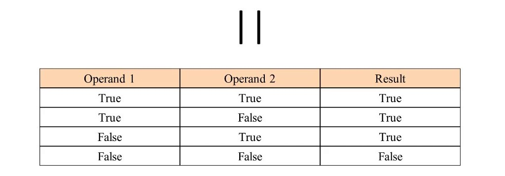

# HTML Lists, Control Flow with JS, and the CSS Box Model
## HTML :
In this read we will talk about lists in HTML.
### List in HTML
HTML lists allow web developers to group a set of related items in lists.

And there are three different type of lists :
 * **Unordered List** :
 The list items will be marked with small black circles.

EXP :
```
<ul>
  <li>first list</li>
  <li>second list</li>
  <li>third list</li>
</ul>
```
They will appear like that:
* first list
* second list
* third list

 * **Ordered List** :
 The list items will be marked with numbers.

EXP :
```
<ol>
  <li>first list</li>
  <li>second list</li>
  <li>third list</li>
</ol>
```
They will appear like that:
1. first list
2. second list
3. third list

* **Definition Lists** :
A description list is a list of terms, with a description of each term.
The `<dl>` tag defines the description list, the `<dt>` tag defines the term (name), and the `<dd>` tag describes each term.

EXP :
```
<dl>
  <dt>first</dt>
  <dd>The first definition list</dd>
  <dt>second</dt>
  <dd>The second definition list</dd>
</dl>
```
They will appear like that:

    first
        The first definition list
    second
        The second definition list

## CSS :
In this read we will talk about boxes in CSS.

### Box Width and Height:
In order to set the width and height of an element correctly in all browsers, you need to know how the box model works.
The content area, bounded by the content edge, contains the "real" content of the element, such as text, an image, or a video player. Its dimensions are the content width and the content height It often has a background color or background image.

### Limiting Width in CSS :
The first thing to discuss is width-related properties. We have ``` and `max-width`, and each one of them is important and has its use cases.

* **Min Width**:

When setting the value of ```, its benefit lies in preventing the used value for width property from becoming less than the specified value for `min-width`. Note that the default value for `min-width` is auto, which resolves to 0.

* **Max Width** :

When setting the value of `max-width`, its benefit lies in preventing the used value for width property from becoming more than the specified value for `max-width`. The default value for `max-width` is none.

### Limiting Height in CSS :
In addition to the minimum and maximum width properties, we have the same properties as the height.

* **Min Height**:

When setting the value of `min-height`, its benefit lies in preventing the used value for height property from becoming less than the specified value for `min-height`. Note that the default value for `min-height` is auto, which resolves to 0.

* **Max Height** :

When setting the value of `max-height`, its benefit lies in preventing the used value for height property from becoming more than the specified value for `max-height`. Note that the default value for `max-height` is none.

## JavaScript:
We talked before in read:02 Variables, Data Types and Operators.

### Variables in JS :
Variable means anything that can vary. In JavaScript, a variable stores the data value that can be changed later on. Use the reserved keyword var to declare a variable in JavaScript.

We use `var` or `let` or `const` to define variables.

### Data Types in JS:
In Javascript, there are five basic, or primitive, types of data. The five most basic types of data are `strings`, `numbers`, `booleans`, `undefined`, and `null`( there is more data types ). We refer to these as primitive data types. A single variable can only store a single type of data.

### Operators in JS :
An operator is capable of manipulating a certain value or operand. Operators are used to perform specific mathematical and logical computations on operands.

### Comparison Operators :
perators that compare values and return true or false. The operators include: `>`, `<`, `>=`, `<=`, `===`, and `!==`.

* Less than (`<`) returns true if the value on the left is less than the value on the right, otherwise it returns false.

* Greater than (`>`) returns true if the value on the left is greater than the value on the right, otherwise it returns false.

* Less than or equal to (`<=`) returns true if the value on the left is less than or equal to the value on the right, otherwise it returns false.

* Greater than or equal to (`>=`) returns true if the value on the left is greater than or equal to the value on the right, otherwise it returns false.

* Equal to (`===`) returns true if the value on the left is equal to the value on the right, otherwise it returns false.

* Not equal to (`!==`) returns true if the value on the left is not equal to the value on the right, otherwise it returns false.

### Logical Operators :

There are scenarios, however, in which we must assert whether multiple values or expressions are true. In JavaScript, we can use logical operators to make these assertions.


* `&&` (and) This operator will be truthy (act like true) if and only if the expressions on both sides of it are true.


* `||` (or) This operator will be truthy if the expression on either side of it is true. Otherwise, it will be falsy (act like false).


