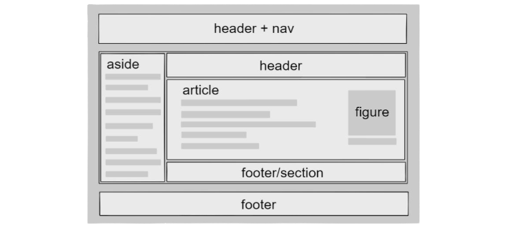

# HTML Links, JS Functions, and Intro to CSS Layout
In `class-04` we will talk about HTML link, JS functions and CSS layout.
## HTML LINKS :
A link is an HTML object that allows you to jump to a new location when you click or tap it. Links are found on almost every webpage and provide a simple means of navigating between pages on the web.

The `<a>` element can be used to insert links inside the content of a HTML document. It redirects their users, or recommend to them, another resource while they read the content of the page.

### So how to use links ?
EXP :

```
 <a href="here we put the URL of the web site we need to redirect the user to it">and here we write the name of it</a> 
```
It will be like this :
[and here we write the name of it](https://www.htmlquick.com/tutorials/links.html)

We not just use links to redirect to other web sites also we can direct to other page on the same web site like :
```
<a href="index.html">Home</a>
<a href="about-us.html">About</a>
<a href="movies.html">Movies</a>
<a href="contact.html">Contact</a>
```
Also we can direct to emails like this :
```
<a href="My-Email@example.org">My Email</a>
```
And we can use links to jump to a specific part of the same page by giving the part ID like this :
```
<h1>The title of the page </h1>
<a href="#end-page">end of the page</a>
<p>lorem text</p>
<h2 id="end-page">last paragraph in the page</h2>
<p>lorem text</p>
```
## CSS :
At this point we've already looked at CSS fundamentals, We have covered the necessary prerequisites so we can now dive deep into CSS layout.
### CSS LAYOUT :

CSS page layout techniques allow us to take elements contained in a web page and control where they are positioned relative to their default position in normal layout flow, the other elements around them, their parent container, or the main viewport/window.



he page layout techniques we'll be covering in more detail in this module are :

1. Normal flow
2. Positioning
3. Floats
4. Multiple-column layout
5. Grid

### 1. Normal flow :
Normal flow is how the browser lays out HTML pages by default when you do nothing to control page layout. Let's look at a quick HTML example:

```
<p>I love my cat.</p>
<ul>
  <li>Buy cat food</li>
  <li>Exercise</li>
  <li>Cheer up friend</li>
</ul>
<p>The end!</p>
```
By default, the browser will display this code as follows :

`I love my cat.`
* `Buy cat food`
* `Exercise`
* `Cheer up friend`

`The end!`

### 2. Positioning :
Positioning allows you to move an element from where it would be placed when in normal flow to another location. Positioning isn’t a method for creating your main page layouts, it is more about managing and fine-tuning the position of specific items on the page.

There are five types of positioning you should know about:
1. **Static positioning** 
    * is the default that every element gets it just means "put the element into its normal position in the document layout flow nothing special to see here".
2. **Relative positioning** 
    * allows you to modify an element's position on the page, moving it relative to its position in normal flow — including making it overlap other elements on the page.
3. **Absolute positioning**
    * moves an element completely out of the page's normal layout flow, like it is sitting on its own separate layer.
4. **Fixed positioning**
    * is very similar to absolute positioning, except that it fixes an element relative to the browser viewport, not another element.
5. **Sticky positioning**
    *   s a newer positioning method which makes an element act like `position: static` until it hits a defined offset from the viewport, at which point it acts like `position: fixed`.

## JavaScript :
In this read we will talk about functions, methods and objects.
### Functions in JS :
A function in JavaScript is a block of statements that performs a task or calculates a value it should take some input and return an output.

### Why we use Functions for?
The main reason to use Functions in **JS** to eliminate code complexity by enabling re-usability. A function is a block of 'reusable code' that is used several times in the JavaScript program where it is defined

### How to use Functions?
JavaScript a function allows you to define a block of code, give it a name and then execute it as many times as you want. A function can be defined using function keyword and can be executed using () operator. A function can include one or more parameters.

We have two ways to write Functions:

1. Function declarations

This way consists of the function keyword, followed by:
* The name of the function.
* A list of parameters to the function, enclosed in parentheses and separated by commas.
* The JavaScript statements that define the function, enclosed in curly brackets, {...}.

**For example**
```
function sum(num,num1) {
  return num * num1;
}
sum(num,num1);
```
The function `sum` takes two parameter, called num & num1. The statement `return` specifies the value returned by the function which is num multiplied by num1.

2. Function expressions

Function Expression  allows us to create an anonymous function which doesn’t have any function name which is the main difference between Function Expression and Function Declaration.

**For example**

```
var sum = function(num,num1) { return num * num1 }
var x = sum(num,num1);
```
### What the difference between Function Expression and Function Declaration?

Function declarations load before any code is executed while Function expressions load only when the interpreter reaches that line of code.

So **Function Expressions** can be used as an Immediately Invoked Function Expressions (IIFE).

## Pair Programming :
We just will talk about additional topic which is `Pair Programming`
### What is Pair Programming :
Pair programming is an agile software development technique in which two programmers work together at one workstation. One, the driver, writes code while the other, the observer or navigator, reviews each line of code as it is typed in. The two programmers switch roles frequently.
### Benefits of Pair Programming :
* increased code quality: “programming out loud” leads to clearer articulation of the complexities and hidden details in coding tasks, reducing the risk of error or going down blind alleys.
* better diffusion of knowledge among the team, in particular when a developer unfamiliar with a component is pairing with one who knows it much better.
* better transfer of skills, as junior developers pick up micro-techniques or broader skills from more experienced team members.
* large reduction in coordination efforts, since there are N/2 pairs to coordinate instead of N individual developers.
* improved resiliency of a pair to interruptions, compared to an individual developer: when one member of the pair must attend to an external prompt, the other can remains focused on the task and can assist in regaining focus afterwards