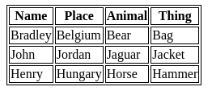

# Domain Modeling, Object-Oriented Programming, HTML Tables
## Domain Modeling :
Domain modeling is the process of creating a conceptual model for a specific problem. And a domain model that's articulated well can verify and validate your understanding of that problem.

Here's some tips to follow when building your own domain models:
* When modeling a single entity that'll have many instances, build self-contained objects with the same attributes and behaviors.
* Model its attributes with a constructor function that defines and initializes properties.
* Model its behaviors with small methods that focus on doing one job well.
* Create instances using the `new` keyword followed by a call to a constructor function.
* Store the newly created object in a variable so you can access its properties and methods from **outside**.
* Use the `this` variable within methods so you can access the object's properties and methods from **inside**.

References: 

[Domain Modeling](https://github.com/codefellows/domain_modeling#domain-modeling)

## HTML Tables :
An HTML table is used for the ​arrangement of data in rows and columns, or possibly in a more complex structure.
### Defining tables in HTML :
An HTML table is defined with the `<table>` tag. Following are some basic tags used for specifying the features of a table:
* `<tr>` tag is used to define each row in a table.
* `<th>` tag is used to define headers of a table.
* `<td>` tag is used to define a table data or a cell.

By default, table headings are bold and centered while data is non-bold and left aligned.

EXP :
```
    <table>
      <tr>
        <th>Name</th>
        <th>Place</th>
        <th>Animal</th>
        <th>Thing</th>
      </tr>
      <tr>
        <td>Bradley</td>
        <td>Belgium</td>
        <td>Bear</td>
        <td>Bag</td>
      </tr>
      <tr>
        <td>John</td>
        <td>Jordan</td>
        <td>Jaguar</td>
        <td>Jacket</td>
        </tr>
      <tr>
        <td>Henry</td>
        <td>Hungary</td>
        <td>Horse</td>
        <td>Hammer</td>
        
      </tr>
    </table>
```
This code will creat table like as follows :




