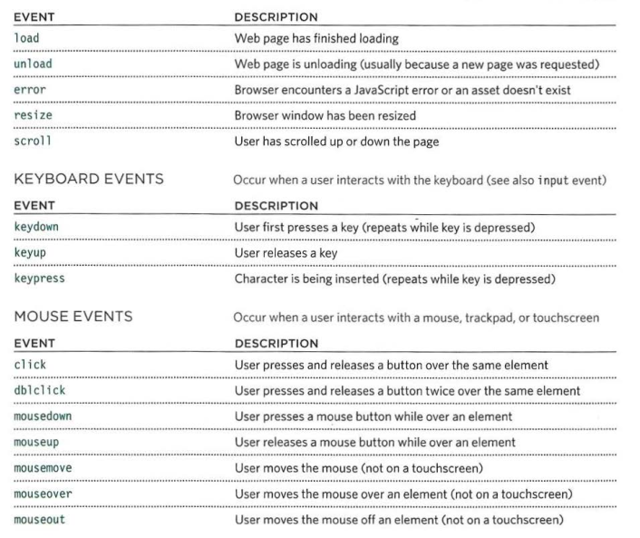

# Forms and JS Events
## Forms in HTML :
### What is the form :
An HTML form is used to collect user input. The user input is most often sent to a server for processing.

Like this :


It's a simple example of HTML forms that takes the user name and password to send it for the checking method.

### How to use forms :
The `<form>` element s used to create an HTML form for user input and the `<input>` element is the most used form element.
An `<input>` element can be displayed in many ways, depending on the type attribute.

Type | Description | Shape
--------- | --------- | ---------
`<input type="text">` | Displays a single-line text input field | <input type="text">
`<input type="radio">` | Displays a radio button (for selecting one of many choices) | <input type="radio">
`<input type="checkbox">` | Displays a checkbox (for selecting zero or more of many choices) | <input type="checkbox">
`<input type="submit">` | Displays a submit button (for submitting the form) | <input type="submit">
`<input type="button">` | Displays a clickable button | <input type="button">

And the code will be like this :

```
<form>
  <label for="fname">First name:</label><br>
  <input type="text" id="fname" name="fname"><br>
  <label for="lname">Last name:</label><br>
  <input type="text" id="lname" name="lname">
</form>
```
The `<label>` tag defines a label for many form elements.

And there are many form tags like :
* `<select>` used to create a drop-down list box.
* `<option>` used to specify the options that the user can select from.
* `<button>` allow users more control over how their buttons.
* `<fieldset>` group related form controls together inside the form.

And more ...

## Lists, Tables and Forms in CSS :
### Lists Properties :
The CSS list properties allow you to:
* Set different list item markers for ordered lists.
* Set different list item markers for unordered lists.
* Set an image as the list item marker.
* Add background colors to lists and list items.

### What are the main properties ?
1. `list-style-type` 
    * Specifies the type of list item marker.
    ```
    ul.a {
    list-style-type: circle;
    }
    ul.b {
    list-style-type: square;
    }
    ol.c {
    list-style-type: upper-roman;
    }
    ol.d {
    list-style-type: lower-alpha;
    }
   ```
2. `list-style-image`
    * Specifies an image as the list item marker.
    ```
    ul {
    list-style-image: url('sqpurple.gif');
    }
    ```
3. `list-style-position`
    * Specifies the position of the list-item markers (bullet points).
    ```
    ul.a {
      list-style-position: outside;
    }
    
    ul.b {
      list-style-position: inside;
    }
    ```
4. `list-style`
    * Is a shorthand property. It is used to set all the list properties in one declaration.
    ```
    ul {
      list-style: square inside url("sqpurple.gif");
    }
    ```
### Tables Properties :
The main properties for tables in CSS:
1. `width`
    *  So set the width of the table.
2. `padding`
    * To control the space between the border and the content in a table.
3. `text-align`
    * Sets the horizontal alignment of the content in the cell.
4. `border-bottom` and `border-top`
    *  Used for horizontal dividers.
5. `:hover`
    *  To highlight table rows on mouse over.
6. `background-color`
    * To change the background color of the alternating table rows.
    
## JavaScript Events :
### What is JS Events :
JavaScript's interaction with HTML is handled through events that occur when the user or the browser manipulates a page. When the user clicks a button, that click is an event.

### What are the events in JS :



How does it work ?

Lets take an example on click Event Type :

Try the following

```
<html>
   <head>   
      <script type = "text/javascript">
            function sayHello() {
               alert("Hello World")
            }
      </script>      
   </head>
   
   <body>
      <p>Click the following button and see result</p>      
      <form>
         <input type = "button" onclick = "sayHello()" value = "Say Hello" />
      </form>      
   </body>
</html>
```

So here we rendered a button when you click on it it will call the function which will print Hello World.

