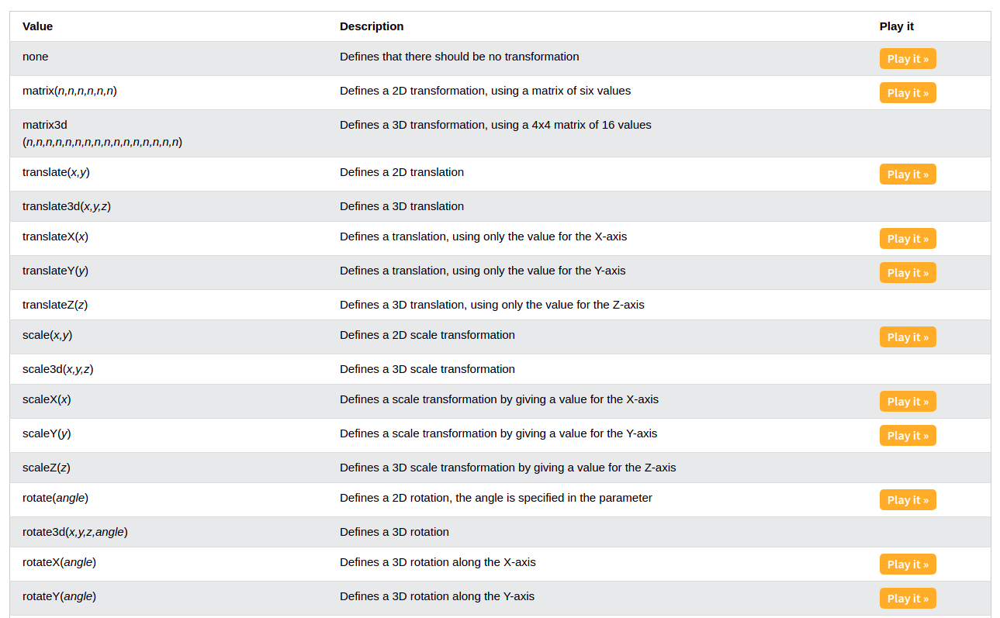
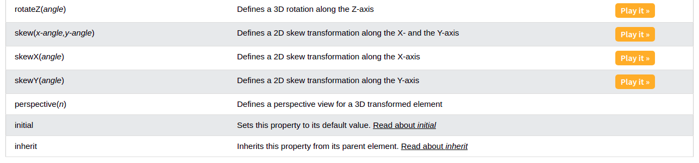

# CSS Transforms, Transitions, and Animations
## CSS Transforms :
### What is CSS Transforms ?
The **`transform`** property applies a 2D or 3D transformation to an element. This property allows you to rotate, scale, move, skew, etc., elements.

Example :

```
#div1 {
    transform: rotate(45deg);
}
```

The result will be as follows :


### Transforms Property Values :





## CSS Transitions :
### What is CSS Transitions ?
CSS **`transitions`** provide a way to control animation speed when changing CSS properties.

### Transitions Properties :
1. **`transition`**
2. **`transition-delay`**
3. **`transition-duration`**
4. **`transition-property`**
5. **`transition-timing-function`**

### How to Use CSS Transitions ?
To create a transition effect, you must specify two things:

* the CSS property you want to add an effect to.
* the duration of the effect.

*`Note`* : If the duration part is not specified, the transition will have no effect, because the default value is 0.

Example :

```
div {
  width: 100px;
  height: 100px;
  background: red;
  transition: width 2s;
}
```

The following example shows a 100px * 100px red `<div>` element. The `<div>` element has also specified a transition effect for the width property, with a duration of 2 seconds.

The transition effect will start when the specified CSS property (width) changes value.

Example :

```
div:hover {
  width: 300px;
}
```

Notice that when the cursor mouses out of the element, it will gradually change back to its original style.


## CSS Animations :
### What is CSS Animations ?
CSS allows animation of HTML elements without using JavaScript or Flash!

### Transitions Properties :
1. **`@keyframes`**
2. **`animation-name`**
3. **`animation-duration`**
4. **`animation-delay`**
5. **`animation-iteration-count`**
6. **`animation-direction`**
7. **`animation-timing-function`**
8. **`animation-fill-mode`**
9. **`animation`**

### How to Use CSS Animations ?

Example :

```
@keyframes shapeshift {
    0%, 100% {
        transform: translate(0,0);  
        border-radius: 100px;
        background-color: red;
    }

    33% {
        transform: translate(200px, -400px) scale(0.5, 0.5);
        border-radius: 0px;
        background-color: blue;
    }

    66% {
        transform: translate(400px, 0) rotate(4545deg) scale(2,2);
        border-radius: 0px;
        background-color: green;
    }
}
```


