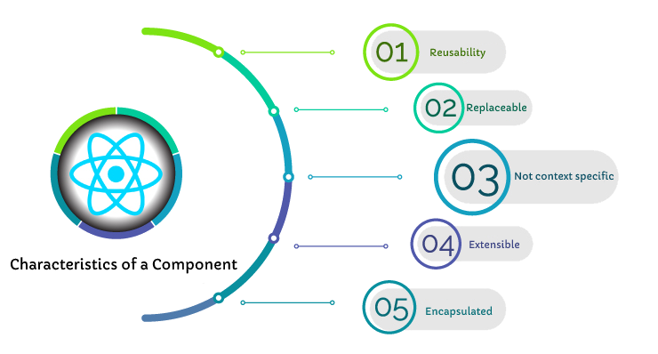

# Introduction to React and Components
In this read we will introduce React and Components, so first =>
## What is React ?


**`React`** is a declarative, efficient, and flexible JavaScript library for building user interfaces. It lets you compose complex UIs from small and isolated pieces of code called “components”.

## What is a Component ?
UI in React broken down into multiple individual pieces called **`Components`** and work on them independently and merge them all in a parent component which will be your final UI.

## What are the Characteristics of a Component ?



1. *`Reusability`* :
    * Components are usually designed to be reused in different situations in different applications. However, some components may be designed for a specific task.
2. *`Replaceable`* :
    * Components may be freely substituted with other similar components.
3. *`Not context specific `*:
    * Components are designed to operate in different environments and contexts.
4. *`Extensible`* :
    * A component can be extended from existing components to provide new behavior.
5. *`Encapsulated`* :
    * A component depicts the interfaces, which allow the caller to use its functionality, and do not expose details of the internal processes or any internal variables or state.
6. *`Independent`* :
    * Components are designed to have minimal dependencies on other components.

## What are the advantages of using component based architecture ?
1. *`Ease of deployment`* :
    * As new compatible versions become available, it is easier to replace existing versions with no impact on the other components or the system as a whole.

2. *`Reduced cost`* :
    * The use of third-party components allows you to spread the cost of development and maintenance.

3. *`Ease of development`* :
    * Components implement well-known interfaces to provide defined functionality, allowing development without impacting other parts of the system.

4. *`Reusable`* :
    * The use of reusable components means that they can be used to spread the development and maintenance cost across several applications or systems.

5. *`Modification of technical complexity`* :
    * A component modifies the complexity through the use of a component container and its services.

6. *`Reliability`* :
    * The overall system reliability increases since the reliability of each individual component enhances the reliability of the whole system via reuse.

7. *`System maintenance and evolution`* :
    * Easy to change and update the implementation without affecting the rest of the system.

8. *`Independent`* :
    * Independency and flexible connectivity of components. Independent development of components by different group in parallel. Productivity for the software development and future software development.

## What is props short for ?
**`Props`** is a special keyword in React, which stands for properties and is being used for passing data from one component to another.

## How are props used in React ?
I will be explaining how to use Props step by step.
1. Firstly, define an attribute and its value(data)
2. Then pass it to child component(s) by using Props
3. Finally, render the Props Data
```
import React, { Component } from 'react'; 
import MyComponent from './MyComponent.jsx'; 
class App extends Component { 
   render() { 
       return ( 
           <div> 
               <MyComponent name = "Michael" /> 
               <MyComponent name = "Professor" /> 
           </div> 
       ); 
   } 
} 
export default App;  
```
And this is our ChildComponent:
```
import React from 'react'; 
const MyComponent = (props) => { 
   return < h1 > {props.name} </ h1> 
} 
export default MyComponent; 
```
Now after calling the child component inside the parent component, here comes the desired output which is
```
Hello Michael 
Hello Professor 
```
## What is the flow of props ?
It's so important to tell that props flow data from parent to child.